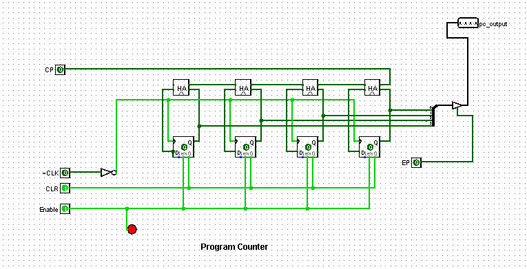
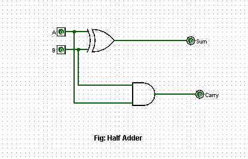

# SAP-1 Computer

A hardware implementation of the **SAP-1 (Simple-As-Possible 1)** processor architecture, built and simulated in Logisim. SAP-1 is a simple  CPU design that demonstrates how a computer fetches, decodes, and executes instructions using only basic digital logic registers, an ALU, a bus, and a control unit.

## Complete Processor

<p align="center">
  
</p>

All modules share a common **8-bit bidirectional bus**. Only one register drives the bus at a time (via a tri-state output), while one or more registers can load from it simultaneously. The Control Unit sequences these load/enable signals every clock cycle to move data around and execute instructions.

### Control Signals

| Signal | Meaning |
|---|---|
| `Cp` / `Ep` | Program Counter: count enable / enable onto bus |
| `Lm` | Load Memory Address Register |
| `CE` | Enable RAM output onto bus |
| `Li` / `Ei` | Load Instruction Register / enable operand onto bus |
| `La` / `Ea` | Load Accumulator / enable Accumulator onto bus |
| `Lb` | Load B Register |
| `Su` / `Eu` | ALU subtract select / enable ALU output onto bus |
| `Lo` | Load Output Register |
| `HLT` | Stop the clock |

### Instruction Set

The Instruction Decoder recognizes 5 opcodes, each mapped to a sequence of the control signals above:

| Opcode | Mnemonic | Operation |
|---|---|---|
| `0000` | `LDA` | Load Accumulator from RAM |
| `0001` | `ADD` | Add RAM value to Accumulator |
| `0010` | `SUB` | Subtract RAM value from Accumulator |
| `1110` | `OUT` | Send Accumulator value to Output Register |
| `1111` | `HLT` | Halt the clock |

---

## Modules

### 1. Program Counter

<p align="center">
  
</p>

A 4-bit synchronous counter that holds the address of the next instruction. On every clock pulse, it increments if `Cp` is high, and can be reset to `0000` with `CLR`. Its output is placed on the bus through a tri-state buffer controlled by `Ep`, so it only drives the bus during the fetch cycle, when the address is sent to the Memory Address Register.

### 2. Memory Address Register (MAR)

<p align="center">
  
</p>

A simple 4-bit latch, not a tri-state register — it has only one work, so it never needs to be disconnected from RAM. When `Lm` is asserted, it captures the address currently on the bus (from the Program Counter or the operand field of an instruction) and holds it permanently on RAM's address lines, selecting which memory word is being read.

### 3. Instruction Register (IR)

<p align="center">
  
</p>

An 8-bit register split into two halves: the upper 4 bits (opcode) and lower 4 bits (operand/address). When `Li` is asserted, it latches the byte currently on the bus, coming from RAM. The opcode nibble feeds directly into the Control Unit's Instruction Decoder. The operand nibble is placed on the bus separately through its own tri-state buffer, gated by `Ei`, whenever the instruction needs to address memory (e.g. during `LDA`, `ADD`, `SUB`).

### 4. Control Unit

<p align="center">
  
</p>

The Control Unit is the "brain" that generates every load/enable signal in the table above. It's built from three sub-circuits working together:

- **Ring Counter** — generates the timing states.
- **Instruction Decoder** — identifies which instruction is currently loaded.
- **Sub-circuit AND/OR matrix** (`Sub_con1`–`Sub_con4`) — combines the timing state with the decoded instruction to activate the correct control lines at the correct moment.

#### 4a. Ring Counter (timing generator)

<p align="center">
  
</p>

A 6-stage shift register of D flip-flops connected in a ring, with feedback through OR/NOT gates so that exactly one output (`T1`–`T6`) is high at any time. On each clock pulse, the "1" shifts to the next flip-flop, producing six sequential timing pulses that represent the six micro-steps of an instruction cycle: `T1`–`T3` are the fixed **fetch** states (common to every instruction), and `T4`–`T6` are the **execute** states, whose behavior depends on the opcode.

#### 4b. Instruction Decoder

<p align="center">
  
</p>

A one-hot decoder built from AND gates and inverters. It takes the 4-bit opcode from the Instruction Register and activates exactly one of its outputs (`Load`, `Add`, `Sub`, `Out`, `Halt`), telling the rest of the Control Unit which instruction is currently executing.

#### 4c. Control Matrix

The `T` signals from the Ring Counter and the opcode signals from the Instruction Decoder are combined through the AND/OR gate matrix shown in the Control Unit diagram to produce each control line — for example, `Lm` is asserted at `T1`, `CE` and `Li` at `T2`, and `Ea`/`La`/`Su`/`Eu` only turn on at `T4`–`T6` if the decoded instruction is `ADD` or `SUB`. This is how the same hardware behaves differently depending on the instruction being run.

### 5. Arithmetic Logic Unit (ALU)

<p align="center">
  
</p>

An 8-bit adder/subtractor built from a chain of full adders. Each bit of the B Register first passes through an XOR gate controlled by the `Su` (subtract) signal:
- When `Su = 0`, the XOR gates pass the B Register bits through unchanged → the adder chain computes `Accumulator + B`.
- When `Su = 1`, the XOR gates invert the B Register bits, and a carry-in of 1 is injected → this produces the two's complement of B, so the adder chain computes `Accumulator − B`.

The result is placed on the bus through tri-state buffers controlled by `Eu`.

#### 5a. Half Adder

<p align="center">
  
</p>

The fundamental 1-bit building block of the adder chain: an XOR gate produces the `Sum`, and an AND gate produces the `Carry`. Each full-adder stage inside the ALU is built by combining two half adders.

#### 5b. Two's Complement Sub-module

<p align="center">
  
</p>

A small combinational block used inside the subtractor path to help generate each bit's carry/borrow logic when computing the two's complement of the B Register during subtraction.

### 6. Accumulator

<p align="center">
  
</p>

An 8-bit tri-state register that stores intermediate arithmetic results. It loads the value on the bus when `La` is asserted (usually the ALU's result), and drives its stored value onto the bus when `Ea` is asserted — most importantly, feeding the ALU directly and independently of the bus for the next operation.

### 7. B Register

<p align="center">
  
</p>

An 8-bit register that holds the second operand for arithmetic operations. It loads from the bus when `Lb` is asserted, and its output feeds the ALU directly at all times — it never needs to drive the shared bus itself, so it doesn't require tri-state outputs.

### 8. Output Register

<p align="center">
  
</p>

An 8-bit latch that captures the bus value when `Lo` is asserted (during an `OUT` instruction) and holds it on a 7-segment display, showing the final result of a program independently of whatever else happens on the bus afterward.

### 9. Tri-State Register (reusable building block)

<p align="center">
  
</p>

Several modules above (Program Counter, Accumulator, Instruction Register operand output) are built around this generic 4-bit component: a bank of D flip-flops with a `LOAD` line that selects between holding the current value and latching new input on the next clock edge, plus tri-state output buffers gated by an `ENABLE` line so the register can be safely connected to the shared bus without conflicting with other devices.

---

## Instruction Cycle

Every instruction executes over 6 clock cycles (`T1`–`T6`), driven by the Ring Counter:

1. **T1 — Address to MAR**: `Ep`, `Lm` — Program Counter's value loads into the MAR.
2. **T2 — Fetch**: `CE`, `Li`, `Cp` — RAM outputs the instruction byte onto the bus into the IR, and the Program Counter increments.
3. **T3 — Decode**: the opcode nibble in the IR feeds the Instruction Decoder; no bus activity yet.
4. **T4–T6 — Execute**: signals specific to the decoded instruction fire (e.g. for `ADD`: `Ei`, `Lm`, `CE`, `Eu`, `La`), moving the operand address to the MAR, fetching the operand, running it through the ALU, and loading the result into the Accumulator.

This fetch–decode–execute loop repeats until a `HLT` instruction stops the clock.

## Getting Started

1. Install [Logisim Evolution](https://github.com/logisim-evolution/logisim-evolution).
2. Open `sap-1-computer.circ` in Logisim Evolution.
3. Load a program into RAM and run the simulation to watch the processor fetch, decode, and execute instructions.

## Repository Structure

```
├── sap-1-computer.circ   # Main Logisim Evolution project file
├── images/                # Circuit diagrams used in this README
└── README.md
```